# Bookshelf

|                                                                                                                                                                                                                                                                    | Finished                             | Rating / Review                 |
|--------------------------------------------------------------------------------------------------------------------------------------------------------------------------------------------------------------------------------------------------------------------|--------------------------------------|---------------------------------|
| [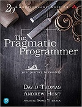](https://pragprog.com/titles/tpp20/the-pragmatic-programmer-20th-anniversary-edition/)                                                                        |  | ❤️️❤️❤️❤️️❤️️ Review pending |
| [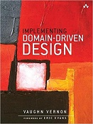](https://www.oreilly.com/library/view/implementing-domain-driven-design/9780133039900/)                                                                                  |    | ️🖤🖤🖤🖤🖤 Review pending   |
| [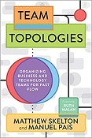](https://teamtopologies.com/book)                                                                                 |    | ️🖤🖤🖤🖤🖤 Review pending   |
|                                                                                                             |    | ️🖤🖤🖤🖤🖤 Review pending   |
| [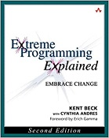](https://www.oreilly.com/library/view/extreme-programming-explained/0321278658/)                                                |  | ️🖤🖤🖤🖤🖤 Review pending   |
| [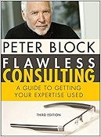](https://www.amazon.com/Flawless-Consulting-Guide-Getting-Expertise/dp/0470620749)                                                            |    | ️🖤🖤🖤🖤🖤 Review pending   |
| [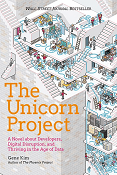](https://itrevolution.com/product/the-unicorn-project/)                                                   |    | ️🖤🖤🖤🖤🖤 Review pending   |
| [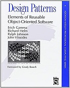](https://www.amazon.com/Design-Patterns-Elements-Reusable-Object-Oriented/dp/0201633612)          |    | ️🖤🖤🖤🖤🖤 Review pending   |
| [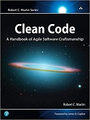](https://www.oreilly.com/library/view/clean-code-a/9780136083238/)                                                                                     |    | ️🖤🖤🖤🖤🖤 Review pending   |
| [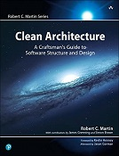](https://www.amazon.de/-/en/Robert-C-Martin/dp/0134494164)                                                                   |    | ️🖤🖤🖤🖤🖤 Review pending   |
| [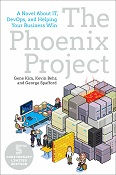](https://itrevolution.com/book/the-phoenix-project/)                                            |    | ️🖤🖤🖤🖤🖤 Review pending   |
| [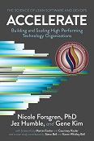](https://itrevolution.com/book/accelerate/)                     |    | ️🖤🖤🖤🖤🖤 Review pending   |
| [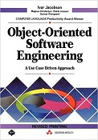](https://www.ivarjacobson.com/publications/books/object-oriented-software-engineering-book)                           |    | ️🖤🖤🖤🖤🖤 Review pending   |
| [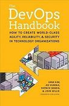](https://itrevolution.com/book/the-devops-handbook/) |    | ️🖤🖤🖤🖤🖤 Review pending   |
